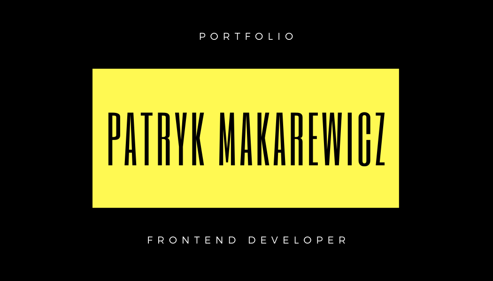

# General info

This is my portfolio.

## Working knowledge

✔ Semantic HTML5  
✔ Flexbox  
✔ Markdown  
✔ JS: Local storage  
✔ Figma  
✔ CSS grid  
✔ Forms  
✔ JS: DOM manipulations  
✔ SASS

## Know something about:

⚪ JavaScript ES6 + features  
⚪ CSS animations  
⚪ Working with API  
⚪ NPM Scripts  
⚪ Progresive web apps  
⚪ GIT  
⚪ Accessibility

## About me

I'm starts a new chapter in my life with programming.  
I'm the father of twins who loves to create code, technological innovations and fast cars.

## How to use it?

Click on `Use this template` button to generate a new repository based on this starter kit. After that clone it to your computer, go to the project directory in console and type `npm install`.

## Available scripts

`npm run start` - runs development mode
